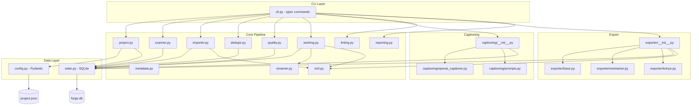
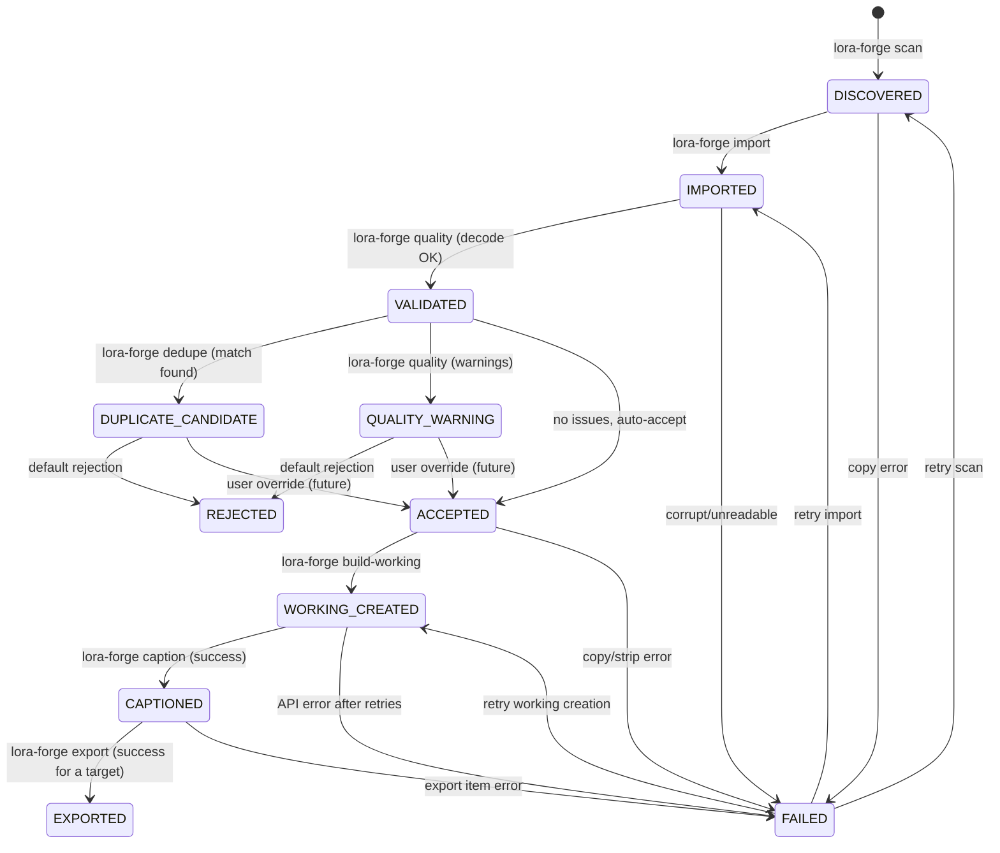
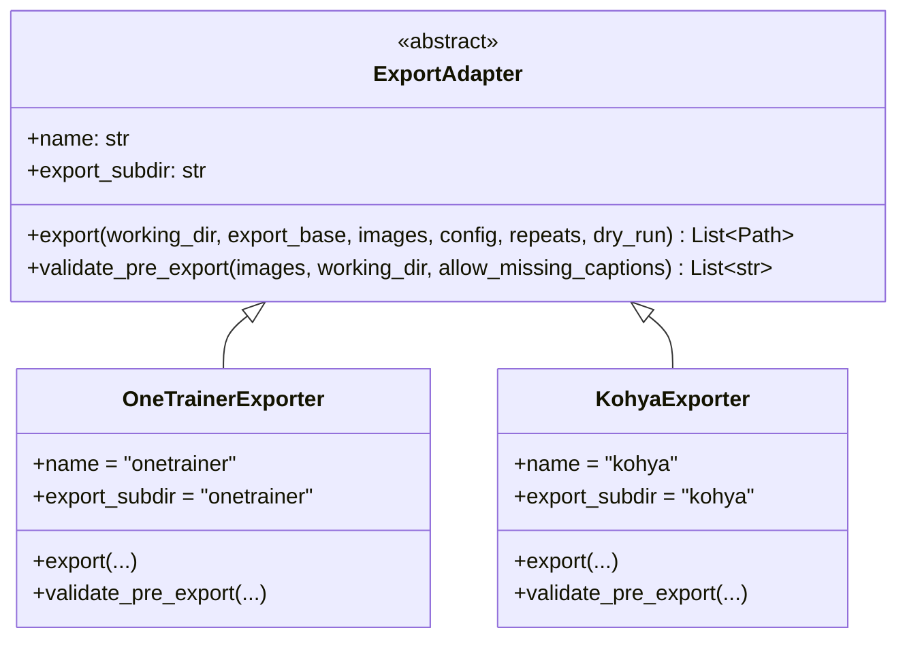
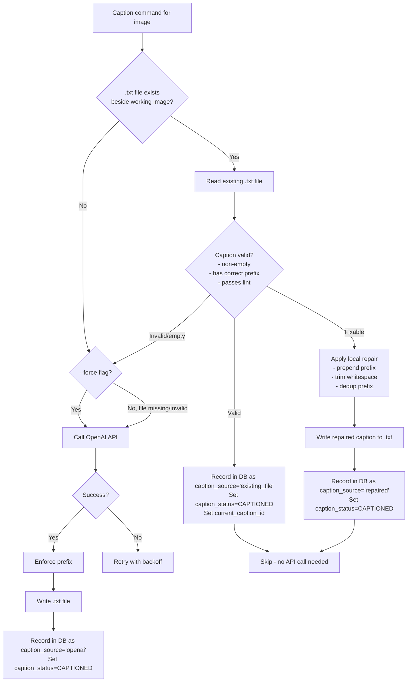
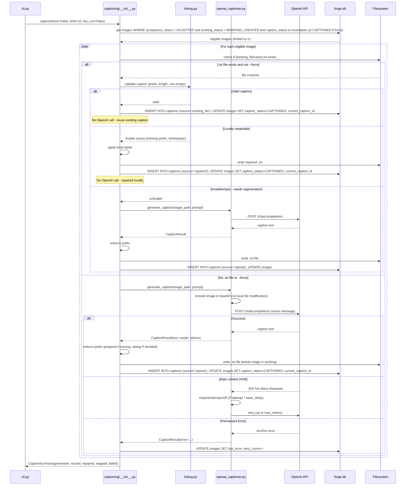
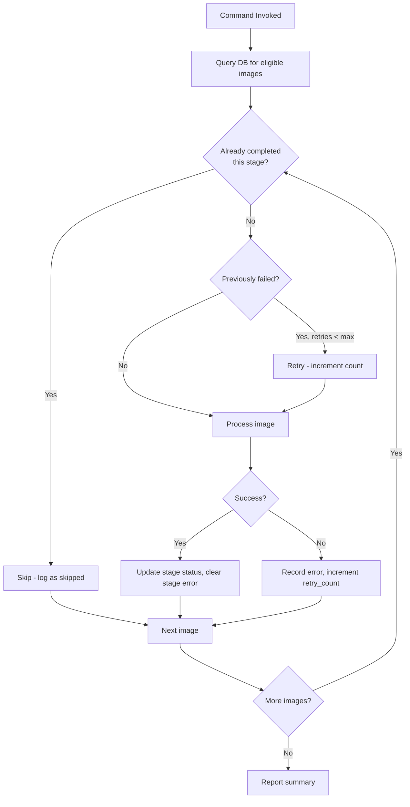

# Design Document: LoRA Dataset Forge

## Overview

LoRA Dataset Forge is a local-first Python CLI application that transforms messy image folders into clean, captioned, privacy-safe datasets for LoRA training. It provides a structured pipeline with resume-safe processing, dry-run mode, and export adapters for multiple training frameworks.

The application follows a three-stage file lifecycle (source → working → exports) with SQLite-backed state tracking. Every operation is idempotent and skippable—the system checks existing state before processing and never re-does completed work unless explicitly forced.

**Primary export target:** OneTrainer (flat directory, no repeats wrapper)
**Secondary export target:** kohya_ss (`{repeats}_{trigger} {class}/` wrapper)

The `working/` directory is the trainer-agnostic source of truth. Export adapters read from `working/` and produce trainer-specific output without influencing internal project structure.

## Architecture



### Design Decisions

1. **SQLite over JSON for state** — Resume-safe processing requires atomic writes and querying by status. SQLite gives us transactions, indexes, and concurrent-safe reads without external dependencies.

2. **Pydantic for configuration** — `project.json` validation catches misconfiguration early. Pydantic provides defaults, type coercion, and clear error messages.

3. **Adapter pattern for exports** — OneTrainer and kohya_ss have different folder conventions. An abstract base class lets us add future trainers (e.g., sd-scripts, SimpleTuner) without touching pipeline logic.

4. **Pillow + piexif for EXIF** — Pillow handles image I/O; piexif can strip EXIF segments from JPEG without re-encoding pixel data, preserving quality.

5. **Per-stage image state** — Each image stores independent stage statuses for scan, import, validation, dedupe, quality, acceptance, working, and captioning. A derived lifecycle state may be displayed for humans, but resume logic never depends on a single status field as the sole source of truth.

## Components and Interfaces

### Module Responsibilities

| Module | Responsibility |
|--------|---------------|
| `cli.py` | Typer command definitions, argument parsing, dry-run gating, rich output |
| `config.py` | Pydantic models for `project.json`, defaults, validation |
| `project.py` | Project initialization, directory creation, config/db bootstrapping |
| `scanner.py` | Recursive file discovery with ignore rules, extension filtering |
| `importer.py` | Copy files from input to `source/`, record in DB |
| `metadata.py` | File hash (SHA-256), perceptual hash (imagehash), dimension extraction |
| `exif.py` | EXIF stripping without recompression where possible |
| `renamer.py` | Sequential naming logic, index assignment, mapping storage |
| `working.py` | Build the `working/` dataset from accepted `source/` images; select only images with `acceptance_status='ACCEPTED'`; assign stable sequential working filenames; copy accepted images from `source/` to `working/`; strip EXIF while writing working images; never mutate the input folder or `source/`; store original → source → working → caption filename mappings; set `working_status='WORKING_CREATED'` after successful working image creation |
| `dedupe.py` | Exact (file hash) and near (perceptual hash) duplicate detection |
| `quality.py` | Resolution, aspect ratio, blur, brightness checks via OpenCV/Pillow |
| `captioning/__init__.py` | Caption orchestration, skip/force logic, limit enforcement |
| `captioning/openai_captioner.py` | OpenAI API calls, retry, backoff, image encoding |
| `captioning/prompts.py` | Prompt templates for character mode (and future modes) |
| `linting.py` | Caption validation rules, `--fix` repairs |
| `exporter/base.py` | Abstract `ExportAdapter` interface |
| `exporter/onetrainer.py` | Flat directory export (default) |
| `exporter/kohya.py` | `{repeats}_{trigger} {class}/` wrapper export |
| `reporting.py` | Markdown and JSON report generation |
| `state.py` | SQLite connection, schema management, query helpers |
| `utils.py` | Shared utilities (path helpers, rich formatting, dry-run context) |

### CLI Commands

The MVP CLI exposes each pipeline stage explicitly:

```bash
lora-forge init <input_folder> --name <project_name> --trigger <trigger_token> --class-token <class_token>
lora-forge scan
lora-forge import
lora-forge quality
lora-forge dedupe
lora-forge accept
lora-forge build-working
lora-forge caption
lora-forge lint
lora-forge export --target onetrainer
lora-forge report
lora-forge status
lora-forge doctor
lora-forge test-openai
```

The corrected full pipeline order is:

```text
init
scan
import
validate/quality
dedupe
acceptance decision
build-working
caption
lint
export
report
```

`lora-forge build-working` runs after accept/reject and before captioning. It is the only command that creates or updates `working/` images, and captioning is not eligible to make OpenAI calls until build-working has completed successfully for an accepted image.


### Key Interfaces

```python
# config.py
class QualityConfig(BaseModel):
    min_width: int = 512
    min_height: int = 512
    max_aspect_ratio: float = 2.5
    blur_threshold: float = 100.0
    dark_threshold: int = 35
    bright_threshold: int = 220

class CaptionLintConfig(BaseModel):
    min_chars: int = 20
    max_chars: int = 220

class DedupeConfig(BaseModel):
    phash_threshold: int = 10

class ExportConfig(BaseModel):
    default_repeats: int = 20
    preserve_format: bool = True
    convert_format: Optional[str] = None
    default_target: str = "onetrainer"

class ProjectConfig(BaseModel):
    project_name: str
    trigger_token: str
    class_token: str
    source_folder: str
    caption_mode: str = "character"
    openai_model: str = "gpt-4o"
    created_at: str
    quality: QualityConfig = QualityConfig()
    caption_lint: CaptionLintConfig = CaptionLintConfig()
    dedupe: DedupeConfig = DedupeConfig()
    export: ExportConfig = ExportConfig()

    @property
    def caption_prefix(self) -> str:
        """Generated caption prefix: '{trigger_token} {class_token},'"""
        return f"{self.trigger_token} {self.class_token},"
```

#### Trigger/Class Token Validation (Project Initialization)

The `init` command MUST validate trigger and class tokens before creating the project. Validation runs during Pydantic model construction via custom validators.

**Validation rules:**

| Rule | Error if violated |
|------|-------------------|
| `trigger_token` is required (non-empty) | "Trigger token is required" |
| `class_token` is required (non-empty) | "Class token is required" |
| `trigger_token != class_token` | "Trigger token must differ from class token" |
| `trigger_token` contains no spaces | "Trigger token must not contain spaces" |
| `trigger_token` uses safe chars (alphanumeric, underscore, hyphen only) | "Trigger token contains unsafe characters" |
| `trigger_token` is not a generic class word | "Trigger token must not be a common class word" |
| `class_token` is compatible with `caption_mode` | "Class token incompatible with caption mode" |

**Generic class words (blocked as trigger tokens):**
```python
GENERIC_CLASS_WORDS = {
    "woman", "man", "person", "girl", "boy", "child",
    "dog", "cat", "animal", "character", "style",
    "portrait", "photo", "image", "picture",
}
```

**Character mode compatible class tokens:**
```python
CHARACTER_MODE_CLASS_TOKENS = {
    "woman", "man", "person", "girl", "boy", "child",
    "dog", "cat", "animal", "character",
}
```

**Safe filename/caption character pattern:**
```python
import re
SAFE_TOKEN_PATTERN = re.compile(r'^[a-zA-Z0-9_-]+$')
```

**Validation implementation:**
```python
from pydantic import field_validator

class ProjectConfig(BaseModel):
    # ... fields ...

    @field_validator('trigger_token')
    @classmethod
    def validate_trigger_token(cls, v, info):
        if not v or not v.strip():
            raise ValueError("Trigger token is required")
        if ' ' in v:
            raise ValueError("Trigger token must not contain spaces")
        if not SAFE_TOKEN_PATTERN.match(v):
            raise ValueError("Trigger token contains unsafe characters (use alphanumeric, underscore, or hyphen only)")
        if v.lower() in GENERIC_CLASS_WORDS:
            raise ValueError(f"Trigger token must not be a common class word: {v}")
        return v

    @field_validator('class_token')
    @classmethod
    def validate_class_token(cls, v, info):
        if not v or not v.strip():
            raise ValueError("Class token is required")
        return v

    @model_validator(mode='after')
    def validate_token_pair(self):
        if self.trigger_token.lower() == self.class_token.lower():
            raise ValueError("Trigger token must differ from class token")
        if self.caption_mode == "character":
            if self.class_token.lower() not in CHARACTER_MODE_CLASS_TOKENS:
                raise ValueError(
                    f"Class token '{self.class_token}' is not compatible with character mode. "
                    f"Use one of: {', '.join(sorted(CHARACTER_MODE_CLASS_TOKENS))}"
                )
        return self
```

**Caption prefix generation:**
The validated config produces the caption prefix as `{trigger_token} {class_token},` — this is used throughout captioning, linting, and prefix enforcement.

```python
# exporter/base.py
from abc import ABC, abstractmethod
from pathlib import Path
from typing import List
from ..state import ImageRecord

class ExportAdapter(ABC):
    """Base class for trainer-specific export adapters."""

    @property
    @abstractmethod
    def name(self) -> str:
        """Identifier for this export profile (e.g., 'onetrainer', 'kohya')."""
        ...

    @property
    @abstractmethod
    def export_subdir(self) -> str:
        """Subdirectory name under exports/ for this adapter."""
        ...

    @abstractmethod
    def export(
        self,
        working_dir: Path,
        export_base: Path,
        images: List[ImageRecord],
        config: "ProjectConfig",
        repeats: int = 20,
        dry_run: bool = False,
    ) -> List[Path]:
        """
        Export captioned images from working/ to the adapter's target structure.
        Returns list of exported file paths.
        """
        ...

    @abstractmethod
    def validate_pre_export(
        self,
        images: List[ImageRecord],
        working_dir: Path,
        allow_missing_captions: bool = False,
    ) -> List[str]:
        """
        Validate that all prerequisites are met for export.
        Returns list of error messages (empty = valid).
        """
        ...
```

```python
# captioning/openai_captioner.py
class OpenAICaptioner:
    """Handles OpenAI vision API calls for caption generation."""

    def __init__(self, api_key: str, model: str, max_retries: int = 3):
        ...

    def generate_caption(self, image_path: Path, prompt: str) -> CaptionResult:
        """Generate a caption for a single image. Handles encoding and retry."""
        ...

    def test_connection(self) -> ConnectionTestResult:
        """Verify API key and connectivity without sending images."""
        ...
```

## Data Models

### File Lifecycle

```mermaid
graph LR
    INPUT[Input_Folder<br/>User's original images<br/>NEVER modified] -->|copy with<br/>original names| SOURCE[source/<br/>Immutable copies<br/>Original metadata preserved]
    SOURCE -->|accept, rename,<br/>strip EXIF| WORKING[working/<br/>Sequential names<br/>EXIF stripped<br/>Captions beside images]
    WORKING -->|export adapter<br/>reads from working/| EXPORTS[exports/<br/>Trainer-specific profiles]

    EXPORTS --> OT[exports/onetrainer/<br/>Flat: image + caption pairs]
    EXPORTS --> KOH[exports/kohya/<br/>{repeats}_{trigger} {class}/<br/>image + caption pairs]
```

**Stage details:**

| Stage | Location | Contents | Mutations Allowed |
|-------|----------|----------|-------------------|
| Input | User's folder | Original images | None (never touched) |
| Source | `project/source/` | Byte-identical copies, original filenames | None after import |
| Working | `project/working/` | Accepted images: renamed, EXIF-stripped, paired with `.txt` captions | Captions added/updated |
| Export | `project/exports/{adapter}/` | Trainer-ready dataset, EXIF-stripped, sequential | Rebuilt on each export |

### State Database Schema (forge.db)

```sql
-- Core image tracking table
CREATE TABLE images (
    id INTEGER PRIMARY KEY AUTOINCREMENT,
    -- Identity
    original_filename TEXT NOT NULL,
    original_path TEXT NOT NULL,
    file_extension TEXT NOT NULL,
    file_size INTEGER NOT NULL,

    -- Hashes (computed at scan time)
    file_hash TEXT,           -- SHA-256 of file bytes
    perceptual_hash TEXT,     -- imagehash pHash hex string

    -- Dimensions (populated at validation)
    width INTEGER,
    height INTEGER,

    -- Per-stage status tracking
    scan_status TEXT NOT NULL DEFAULT 'DISCOVERED',
    import_status TEXT,
    validation_status TEXT,
    dedupe_status TEXT,
    quality_status TEXT,
    acceptance_status TEXT,
    working_status TEXT,
    caption_status TEXT,
    -- Optional derived display state, never the sole source of truth
    lifecycle_state TEXT NOT NULL DEFAULT 'DISCOVERED',

    -- File mappings
    source_filename TEXT,     -- filename in source/ (same as original)
    working_filename TEXT,    -- sequential name in working/  e.g., dawivre_0001.jpg
    working_index INTEGER,    -- sequential index assigned
    caption_filename TEXT,    -- e.g., dawivre_0001.txt

    -- Quality flags (comma-separated if multiple)
    quality_flags TEXT,       -- e.g., "WARN_BLURRY,WARN_DARK"

    -- Duplicate tracking
    duplicate_of_id INTEGER,  -- references images.id of the "keep" image
    duplicate_type TEXT,      -- 'exact' or 'near'
    hamming_distance INTEGER, -- for near-duplicates

    -- EXIF tracking for working image creation
    working_exif_stripped BOOLEAN DEFAULT FALSE,
    working_exif_strip_timestamp TEXT,

    -- Error and retry tracking
    last_error TEXT,
    retry_count INTEGER DEFAULT 0,
    last_attempted_at TEXT,
    failed_stage TEXT,        -- which stage failed

    -- Acceptance tracking
    acceptance_decision TEXT,  -- 'ACCEPTED' or 'REJECTED'
    acceptance_timestamp TEXT,

    -- Timestamps
    discovered_at TEXT NOT NULL,
    imported_at TEXT,
    validated_at TEXT,
    accepted_at TEXT,
    working_created_at TEXT,
    captioned_at TEXT,

    -- Active caption reference
    current_caption_id INTEGER,  -- references captions.id for the active caption

    -- Constraints
    UNIQUE(original_path),
    FOREIGN KEY(duplicate_of_id) REFERENCES images(id),
    FOREIGN KEY(current_caption_id) REFERENCES captions(id)
);

-- Caption metadata table
CREATE TABLE captions (
    id INTEGER PRIMARY KEY AUTOINCREMENT,
    image_id INTEGER NOT NULL,
    caption_text TEXT NOT NULL,
    caption_source TEXT NOT NULL,   -- 'openai', 'existing_file', 'manual', 'repaired'
    model_name TEXT,               -- e.g., "gpt-4o" (NULL for non-OpenAI sources)
    prompt_version TEXT,           -- e.g., "character_v1" (NULL for non-OpenAI sources)
    generated_at TEXT NOT NULL,
    generation_status TEXT NOT NULL, -- 'success', 'failed', 'retrying'
    retry_count INTEGER DEFAULT 0,
    last_error TEXT,
    token_count INTEGER,            -- approximate token count of caption (NULL for non-OpenAI)

    FOREIGN KEY(image_id) REFERENCES images(id)
);

-- Export run records table
CREATE TABLE export_runs (
    id INTEGER PRIMARY KEY AUTOINCREMENT,
    export_profile TEXT NOT NULL,   -- 'onetrainer' or 'kohya'
    target_path TEXT NOT NULL,       -- relative path within exports/
    repeats INTEGER,                 -- NULL for profiles without repeats
    started_at TEXT NOT NULL,
    completed_at TEXT,
    status TEXT NOT NULL,            -- 'running', 'success', 'failed'
    completeness_status TEXT NOT NULL,
    allow_missing_captions BOOLEAN DEFAULT FALSE,
    last_error TEXT
);

-- Per-export item records table
CREATE TABLE export_items (
    id INTEGER PRIMARY KEY AUTOINCREMENT,
    export_run_id INTEGER NOT NULL,
    image_id INTEGER NOT NULL,
    export_profile TEXT NOT NULL,   -- 'onetrainer' or 'kohya'
    export_path TEXT NOT NULL,      -- relative path within exports/
    exported_at TEXT NOT NULL,
    exif_stripped BOOLEAN DEFAULT TRUE,
    format_converted BOOLEAN DEFAULT FALSE,
    converted_from TEXT,
    converted_to TEXT,

    FOREIGN KEY(export_run_id) REFERENCES export_runs(id),
    FOREIGN KEY(image_id) REFERENCES images(id)
);

-- Format conversion tracking (for optional --convert)
CREATE TABLE conversions (
    id INTEGER PRIMARY KEY AUTOINCREMENT,
    image_id INTEGER NOT NULL,
    original_format TEXT NOT NULL,
    converted_format TEXT NOT NULL,
    conversion_timestamp TEXT NOT NULL,
    conversion_settings TEXT,       -- JSON blob of settings used

    FOREIGN KEY(image_id) REFERENCES images(id)
);

-- Schema version for future migrations
CREATE TABLE schema_version (
    version INTEGER NOT NULL,
    applied_at TEXT NOT NULL
);

-- Indexes for common queries
CREATE INDEX idx_images_scan_status ON images(scan_status);
CREATE INDEX idx_images_import_status ON images(import_status);
CREATE INDEX idx_images_validation_status ON images(validation_status);
CREATE INDEX idx_images_dedupe_status ON images(dedupe_status);
CREATE INDEX idx_images_quality_status ON images(quality_status);
CREATE INDEX idx_images_acceptance_status ON images(acceptance_status);
CREATE INDEX idx_images_working_status ON images(working_status);
CREATE INDEX idx_images_caption_status ON images(caption_status);
CREATE INDEX idx_images_file_hash ON images(file_hash);
CREATE INDEX idx_images_perceptual_hash ON images(perceptual_hash);
CREATE INDEX idx_captions_image_id ON captions(image_id);
CREATE INDEX idx_export_runs_profile ON export_runs(export_profile);
CREATE INDEX idx_export_runs_status ON export_runs(status);
CREATE INDEX idx_export_items_run_id ON export_items(export_run_id);
CREATE INDEX idx_export_items_image_id ON export_items(image_id);
CREATE INDEX idx_export_items_profile ON export_items(export_profile);
```

**Schema design rationale:**

- **Single `images` table for image identity and per-stage state** — avoids JOINs for common image workflow queries while keeping each processing stage independently resumable. The optional `lifecycle_state` is a display/cache field derived from per-stage statuses, not authoritative state. The `current_caption_id` foreign key points to the active caption for the image.
- **Separate `captions` table** — supports caption history (re-captions with `--force` create new rows, keeping the old caption for auditability). The `caption_source` field tracks provenance: `openai` for API-generated, `existing_file` for pre-existing .txt files discovered during caption command, `repaired` for locally-fixed captions, and `manual` for user-edited captions.
- **Separate `export_runs` and `export_items` tables** — each export invocation records target, status, completeness, and errors once, while exported files are tracked per image and per target. One image can be exported to multiple profiles and multiple runs without conflating target state.
- **`schema_version` table** — enables future schema migrations without breaking existing projects.

### Per-Stage Status Model

The diagram below shows the derived lifecycle progression for readability. Implementation uses the per-stage columns in `images`, and command eligibility is based on the relevant stage status plus prerequisite stage statuses.



**Stage status columns:**

| Stage | Column | Successful values | Failure value |
|-------|--------|-------------------|---------------|
| Scan | `scan_status` | `DISCOVERED` | `FAILED` |
| Import | `import_status` | `IMPORTED` | `FAILED` |
| Validation | `validation_status` | `VALIDATED` | `FAILED` |
| Dedupe | `dedupe_status` | `NO_DUPLICATE`, `DUPLICATE_CANDIDATE` | `FAILED` |
| Quality | `quality_status` | `PASS`, `QUALITY_WARNING` | `FAILED` |
| Acceptance | `acceptance_status` | `ACCEPTED`, `REJECTED` | `FAILED` |
| Working | `working_status` | `WORKING_CREATED` | `FAILED` |
| Caption | `caption_status` | `CAPTIONED`, `MISSING`, `INVALID` | `FAILED` |

Export state is not stored on `images`; it is tracked per target and per invocation in `export_runs` and `export_items`.

**Key rules:**
- Stage statuses only move forward within their stage unless a failed stage is retried
- Captioning ONLY processes images when `acceptance_status='ACCEPTED'` and `working_status='WORKING_CREATED'`; no OpenAI caption call may occur before build-working succeeds for that image
- Export ONLY reads from `working/` and requires valid captions unless `--allow-missing-captions` is set
- `--force` on caption regenerates even for CAPTIONED images


### Export Adapter Interface

The export subsystem uses a strategy pattern to decouple trainer-specific folder conventions from the core pipeline.



**OneTrainerExporter** (Default):
```
exports/onetrainer/
  dawivre_0001.jpg
  dawivre_0001.txt
  dawivre_0002.jpg
  dawivre_0002.txt
  ...
```
- Flat directory structure
- No repeats folder wrapper
- Sequential filenames without gaps
- EXIF stripped on all exported images

**KohyaExporter** (Secondary):
```
exports/kohya/
  20_dawivre woman/
    dawivre_0001.jpg
    dawivre_0001.txt
    dawivre_0002.jpg
    dawivre_0002.txt
    ...
```
- Single subfolder: `{repeats}_{trigger_token} {class_token}/`
- Repeats configurable (default: 20 from `project.json`)
- Sequential filenames without gaps inside the repeats folder
- EXIF stripped on all exported images

**Adding a future adapter** (e.g., SimpleTuner, sd-scripts):
1. Create `exporter/simpletuner.py`
2. Subclass `ExportAdapter`
3. Implement `export()` and `validate_pre_export()`
4. Register in `exporter/__init__.py` adapter registry
5. No changes to core pipeline, CLI, or state management

**Adapter Registry:**
```python
# exporter/__init__.py
from .onetrainer import OneTrainerExporter
from .kohya import KohyaExporter

ADAPTERS: dict[str, type[ExportAdapter]] = {
    "onetrainer": OneTrainerExporter,
    "kohya": KohyaExporter,
}

def get_adapter(target: str) -> ExportAdapter:
    """Get export adapter by name. Raises ValueError for unknown targets."""
    if target not in ADAPTERS:
        raise ValueError(f"Unknown export target: {target}. Available: {list(ADAPTERS.keys())}")
    return ADAPTERS[target]()

def export_all(working_dir, export_base, images, config, repeats, dry_run):
    """Export using all registered adapters."""
    results = {}
    for name, adapter_cls in ADAPTERS.items():
        adapter = adapter_cls()
        results[name] = adapter.export(working_dir, export_base, images, config, repeats, dry_run)
    return results
```

**Export adapter contract:**
- Adapters read ONLY from `working/` — they never access `source/` or modify `working/`
- Adapters handle their own EXIF stripping (delegating to `exif.py`)
- Adapters produce sequential filenames without gaps in their output
- Adapters are stateless — they receive all needed data as parameters
- Adapters report dry-run actions through a shared output interface

### OpenAI Captioning Adapter

#### Caption Discovery/Reuse Before OpenAI Generation

Before calling the OpenAI API for any image, the caption command MUST require `working_status='WORKING_CREATED'` and first check whether a matching `.txt` file already exists beside the working image. This prevents duplicate inference costs during restart/resume and supports manual caption workflows. Images that have not successfully completed `lora-forge build-working` are never sent to OpenAI.

**Caption Discovery Flow:**



**Decision rules for calling OpenAI:**

| Condition | Action |
|-----------|--------|
| No .txt file exists | Call OpenAI |
| .txt file exists but is empty | Call OpenAI |
| .txt file exists, invalid, not locally repairable | Call OpenAI |
| .txt file exists, valid | Record as `existing_file`, skip OpenAI |
| .txt file exists, fixable (missing prefix, whitespace) | Repair locally, record as `repaired`, skip OpenAI |
| `--force` flag set | Always call OpenAI regardless of existing file |

**Sequence Diagram (Full):**



**API Key Loading:**
```python
def load_api_key() -> str:
    """Load OpenAI API key from environment or .env file.
    
    Priority:
    1. OPENAI_API_KEY environment variable
    2. .env file in project root
    3. .env file in user home directory
    
    Raises ConfigError if not found.
    Never logs or displays the key value.
    """
```

**Image Encoding for API Submission:**
- Read the working image file bytes
- Base64-encode for the OpenAI vision API `image_url` field with `data:image/{format};base64,{data}`
- No resizing, modification, or temp file creation of local working images
- If the image exceeds OpenAI's size limits, encode a resized version in-memory only (never written to disk)

**Retry with Exponential Backoff:**
```python
class RetryConfig:
    max_retries: int = 3
    base_delay: float = 2.0       # seconds
    max_delay: float = 60.0       # cap
    jitter: bool = True           # random jitter to avoid thundering herd
    retry_on: tuple = (429, 500, 502, 503, 504)
```

Delay formula: `min(base_delay * 2^attempt + jitter, max_delay)`

**Per-Image Caption Metadata Recording:**
Each caption generation records:
- `caption_source` — provenance of the caption: `openai`, `existing_file`, `manual`, or `repaired`
- `model_name` — the OpenAI model used (e.g., "gpt-4o"); NULL for non-OpenAI sources
- `prompt_version` — versioned identifier for the prompt template (e.g., "character_v1"); NULL for non-OpenAI sources
- `generated_at` — ISO 8601 timestamp
- `generation_status` — 'success' or 'failed'
- `retry_count` — how many retries were needed (0 for existing_file/repaired)
- `token_count` — approximate token count (from API response usage); NULL for non-OpenAI sources

The `images.current_caption_id` is updated to point to the newly created caption record, making it the active caption for that image.

**`--limit` Support:**
- Query uncaptioned images, apply LIMIT clause
- Process exactly n images then stop
- Report: "Captioned {n} of {total_uncaptioned} remaining images"

**`--force` Support:**
- Override skip-on-success logic AND caption discovery logic
- Query CAPTIONED and WORKING_CREATED images (all eligible)
- Ignore existing .txt files — always call OpenAI
- Create new caption record with `caption_source='openai'` (old caption preserved in `captions` table for history)
- Update `images.current_caption_id` to point to new caption
- Overwrite the `.txt` file in `working/`

**Character Caption Mode Prompt Structure:**
```python
CHARACTER_CAPTION_PROMPT = """
You are generating training captions for a LoRA character dataset.

RULES:
- Begin with EXACTLY: "{trigger_token} {class_token},"
- Follow with comma-separated descriptive tags
- Describe: pose, clothing, expression, setting, lighting, camera angle/framing
- Use concise, factual phrases
- Do NOT use poetic language, subjective opinions, or full sentences
- Do NOT guess identity, age, ethnicity, or sensitive attributes
- Do NOT reference private metadata, EXIF data, or filenames
- Keep the caption between 20 and 220 characters total

EXAMPLE OUTPUT:
{trigger_token} {class_token}, smiling, wearing a blue shirt, standing outdoors, natural lighting, medium shot

Generate a caption for this image:
"""
```

### EXIF Stripping Strategy

**Goals:**
- Remove all privacy-sensitive metadata (GPS, camera, device, timestamps)
- Preserve pixel data exactly (no visual changes)
- Avoid recompression where technically feasible
- Handle JPEG, PNG, and WebP formats

**Technical Approach by Format:**

| Format | Strategy | Library | Recompression? |
|--------|----------|---------|----------------|
| JPEG | Remove EXIF segments from byte stream and write a separate output file | piexif | No — preserves encoded image data |
| PNG | Remove text chunks (tEXt, iTXt, zTXt) and eXIf chunk | Pillow | No — reconstruct without metadata chunks |
| WebP | Re-save with `exif=b""` parameter | Pillow | Minimal (WebP re-encode, lossless if original was lossless) |

**JPEG Strategy (piexif — zero recompression):**
```python
import piexif

def strip_exif_jpeg(input_path: Path, output_path: Path) -> None:
    """Strip EXIF from JPEG without re-encoding pixel data.
    
    Uses piexif to remove EXIF segments from the JPEG byte stream.
    The image pixels are never decoded/re-encoded.
    Never call piexif.remove() with input_path as the destination; source/
    and Input_Folder files are read-only inputs to this operation.
    """
    data = input_path.read_bytes()
    stripped = piexif.remove(data)  # Returns bytes with EXIF removed
    output_path.write_bytes(stripped)
```

**PNG Strategy (Pillow chunk filtering):**
```python
from PIL import Image
from PIL.PngImagePlugin import PngInfo

def strip_exif_png(input_path: Path, output_path: Path) -> None:
    """Strip metadata from PNG while preserving pixel data.
    
    Opens image, saves without any metadata chunks.
    PNG is lossless so no quality loss occurs.
    """
    img = Image.open(input_path)
    # Create clean PngInfo with no entries
    clean_info = PngInfo()
    img.save(output_path, pnginfo=clean_info)
```

**WebP Strategy (Pillow re-save):**
```python
def strip_exif_webp(input_path: Path, output_path: Path) -> None:
    """Strip EXIF from WebP.
    
    WebP requires re-save. Use lossless=True if source was lossless,
    otherwise use quality=100 for minimal quality impact.
    """
    img = Image.open(input_path)
    # Detect if original is lossless (check file header)
    is_lossless = detect_webp_lossless(input_path)
    if is_lossless:
        img.save(output_path, format="WEBP", lossless=True, exif=b"")
    else:
        img.save(output_path, format="WEBP", quality=100, exif=b"")
```

**Unified Interface:**
```python
def strip_exif(input_path: Path, output_path: Path) -> ExifStripResult:
    """Strip EXIF metadata from image, dispatching by format.
    
    Returns ExifStripResult with:
    - success: bool
    - method: str (e.g., "piexif_remove", "pillow_resave")
    - recompressed: bool
    - error: Optional[str]
    """
    ext = input_path.suffix.lower()
    if ext in ('.jpg', '.jpeg'):
        return _strip_jpeg(input_path, output_path)
    elif ext == '.png':
        return _strip_png(input_path, output_path)
    elif ext == '.webp':
        return _strip_webp(input_path, output_path)
    else:
        raise UnsupportedFormatError(f"Cannot strip EXIF from {ext}")
```

**Per-Image Recording:**
- `working_exif_stripped` flag in `images` table
- `working_exif_strip_timestamp` for when working-copy stripping occurred
- `export_items.exif_stripped` for each exported image copy
- Stripping happens at working directory creation time and is verified or repeated as needed while writing export copies; input files and `source/` files are never modified in place

### Caption Prefix Validation and Linting

#### Prefix Structure

Every caption MUST begin with exactly one instance of:
```
{trigger_token} {class_token},
```

Example: `dawivre woman,` followed by descriptive tags.

#### Lint Rules (Prefix-Specific)

| Rule ID | Check | Severity | Fixable |
|---------|-------|----------|---------|
| `PREFIX_MISSING` | Caption does not start with `{trigger} {class},` | ERROR | Yes — prepend |
| `PREFIX_TRIGGER_MISSING` | Trigger token not found anywhere in caption | ERROR | Yes — prepend full prefix |
| `PREFIX_CLASS_MISSING` | Class token not found in expected position | ERROR | Yes — prepend full prefix |
| `PREFIX_MALFORMED` | Prefix present but wrong format (e.g., missing comma, wrong order) | ERROR | Yes — replace prefix |
| `PREFIX_DUPLICATED` | Prefix appears more than once | WARNING | Yes — deduplicate |
| `PREFIX_NOT_AT_START` | Prefix found but not at position 0 | ERROR | Yes — move to start |
| `PREFIX_COMMA_MISSING` | `{trigger} {class}` found but no trailing comma | ERROR | Yes — add comma |

#### Full Lint Rule Set

| Rule ID | Check | Severity | Fixable |
|---------|-------|----------|---------|
| `EMPTY_CAPTION` | Caption file is empty or whitespace-only | ERROR | No |
| `CAPTION_TOO_SHORT` | Caption length < `caption_lint.min_chars` | WARNING | No |
| `CAPTION_TOO_LONG` | Caption length > `caption_lint.max_chars` | WARNING | No |
| `DUPLICATE_CAPTION` | Same caption text used for multiple images | WARNING | No |
| `SUBJECTIVE_LANGUAGE` | Caption contains known subjective words | WARNING | No |
| `EXCESS_WHITESPACE` | Leading/trailing whitespace, multiple spaces | WARNING | Yes — trim |

#### `lint --fix` Behavior

The `--fix` flag applies only safe, local repairs:

1. **Prepend missing prefix** — if caption lacks the required `{trigger} {class},` prefix
2. **Remove duplicated prefix** — if prefix appears more than once, reduce to one
3. **Trim whitespace** — remove leading/trailing whitespace and collapse multiple spaces
4. **Add missing comma** — if `{trigger} {class}` found without trailing comma

`lint --fix` MUST NOT:
- Call OpenAI
- Rewrite caption content
- Remove or change descriptive tags
- Fix subjective language
- Fix duplicate captions across files
- Fix captions that are too short or too long (content changes needed)

#### Lint Interface

```python
# linting.py
from dataclasses import dataclass
from typing import List
from pathlib import Path

@dataclass
class LintWarning:
    filename: str
    rule_id: str
    severity: str        # 'ERROR' or 'WARNING'
    message: str
    excerpt: str         # relevant portion of caption text
    fixable: bool
    fixed: bool = False  # set to True if --fix repaired it

def lint_caption(
    caption_text: str,
    trigger_token: str,
    class_token: str,
    config: CaptionLintConfig,
    all_captions: dict[str, str] = None,  # filename -> text for dup check
) -> List[LintWarning]:
    """Lint a single caption text against all rules."""
    ...

def lint_and_fix(
    caption_text: str,
    trigger_token: str,
    class_token: str,
) -> tuple[str, List[LintWarning]]:
    """Apply safe local repairs and return fixed text + warnings that remain."""
    ...
```

### Resume-Safe Processing

Every command in the pipeline follows the same resume pattern:



**Per-image stage tracking in DB:**
- Each command queries the stage-specific status column for eligibility and checks prerequisite stage statuses before processing
- On success, that stage's status advances and the stage error fields are cleared
- On failure, that stage's status becomes `FAILED` and `last_error`, `retry_count`, `failed_stage`, and `last_attempted_at` are updated
- `lifecycle_state` may be recomputed from stage statuses for display, but it is not authoritative for resume decisions

**Skip-on-success logic per command:**

| Command | Processes images when | Skips images when |
|---------|-----------------------|-------------------|
| `scan` | (new files not in DB) | Already in DB (any status) |
| `import` | `scan_status='DISCOVERED'` and `import_status` incomplete/failed | `import_status='IMPORTED'` |
| `quality` | `import_status='IMPORTED'` and validation/quality incomplete/failed | validation and quality already complete |
| `dedupe` | `validation_status='VALIDATED'` and `dedupe_status` incomplete/failed | `dedupe_status` already complete |
| `accept` | validation/dedupe/quality complete and `acceptance_status` incomplete/failed | `acceptance_status` is `ACCEPTED` or `REJECTED` |
| `build-working` | `acceptance_status='ACCEPTED'` and `working_status` incomplete/failed | `working_status='WORKING_CREATED'` |
| `caption` | `acceptance_status='ACCEPTED'`, `working_status='WORKING_CREATED'`, and `caption_status` incomplete/invalid/failed | `caption_status='CAPTIONED'` unless `--force` |
| `export` | valid working image/caption pairs for the requested target | completed `export_items` for the current successful `export_run` |

**Retry-on-failure with count tracking:**
```python
def should_process(image: ImageRecord, stage: str, force: bool = False) -> bool:
    """Determine if an image should be processed for a given stage."""
    if force:
        return True
    stage_status = image.stage_status(stage)
    if stage_status in SUCCESS_STATUSES[stage]:
        return False  # Already completed
    if stage_status == 'FAILED' and image.failed_stage == stage:
        return True  # Retry failed
    return prerequisites_met(image, stage)
```

**`--force` override:**
- For `caption --force`: regenerates even CAPTIONED images
- For other stages: not commonly needed (re-running is inherently safe due to skip logic)
- Force does NOT reset the retry count — it just makes CAPTIONED images eligible again

**Atomic state updates:**
- Each image's stage transition is wrapped in a SQLite transaction
- If the application crashes mid-batch, only in-progress images remain in their previous stage state
- File operations (copy, write caption) happen BEFORE the stage status update — if the DB write fails, the file exists but state hasn't advanced, so re-run will detect the file and skip

**Dry-run interaction with resume:**
- Dry-run queries the DB exactly as a real run would
- Reports what WOULD be processed based on current state
- Never writes to DB, never creates files
- Prefix all planned actions with `[DRY RUN]`


## Correctness Properties

*A property is a characteristic or behavior that should hold true across all valid executions of a system—essentially, a formal statement about what the system should do. Properties serve as the bridge between human-readable specifications and machine-verifiable correctness guarantees.*

### Property 1: Scanner Extension Filtering

*For any* directory tree containing a mix of file types, the scanner SHALL return only files with extensions `.jpg`, `.jpeg`, `.png`, or `.webp` (case-insensitive), and no files with other extensions.

**Validates: Requirements 2.1**

### Property 2: Scanner Directory Ignore Rules

*For any* directory tree containing directories named `.obsidian/`, `.git/`, `.kiro/`, `__MACOSX/`, `node_modules/`, `.venv/`, `venv/`, `exports/`, `working/`, `source/`, `duplicates/`, `rejected/`, or `reports/`, no files from those directories or their subdirectories SHALL appear in scan results.

**Validates: Requirements 2.2, 2.3**

### Property 3: Source Immutability Invariant

*For any* image imported into `source/`, the file SHALL remain byte-identical to the original input file across all subsequent pipeline operations (quality checks, deduplication, acceptance, working creation, captioning, export). No pipeline stage modifies source/ or the original input folder.

**Validates: Requirements 3.1, 3.2, 9.5**

### Property 4: Round-Trip Pixel Preservation

*For any* image processed through the full pipeline (source → working → export), the decoded pixel data (as a numpy array) SHALL be identical at each stage. EXIF stripping and file copying preserve visual content exactly.

**Validates: Requirements 9.3, 23.2**

### Property 5: JPEG EXIF Stripping Without Recompression

*For any* JPEG image, EXIF stripping SHALL remove only the EXIF/metadata segments from the byte stream without re-encoding the image data segments. The JPEG scan data is preserved byte-for-byte.

**Validates: Requirements 9.4**

### Property 6: EXIF Removal Completeness

*For any* image in `working/` or `exports/`, the file SHALL contain no EXIF metadata (no GPS, camera, device, timestamp, or embedded EXIF fields). All metadata segments are removed regardless of image format.

**Validates: Requirements 9.1, 9.2**

### Property 7: Accept/Reject Decision Correctness

*For any* VALIDATED image with no quality_flags and no DUPLICATE_CANDIDATE status, the acceptance decision SHALL be ACCEPTED. *For any* image with DUPLICATE_CANDIDATE or QUALITY_WARNING status, the default acceptance decision SHALL be REJECTED.

**Validates: Requirements 7.1, 7.2, 7.3**

### Property 8: Only Accepted Images in Working Directory

*For any* project state, the `working/` directory SHALL contain files only for images with ACCEPTED (or later) status. No REJECTED, DUPLICATE_CANDIDATE, or QUALITY_WARNING image shall have a corresponding file in `working/`.

**Validates: Requirements 7.5**

### Property 9: Sequential Rename Correctness

*For any* set of N accepted images, working filenames SHALL follow the pattern `{trigger_token}_{index:04d}.{original_extension}` with indices from 1 to N, no gaps, and each image's extension matching its original format.

**Validates: Requirements 8.1, 8.2, 8.3**

### Property 10: Working Filename Stability (Idempotence)

*For any* set of existing working images, re-running the working directory creation command SHALL not change any existing filenames or reassign any indices. New images receive the next available index.

**Validates: Requirements 8.4**

### Property 11: File Mapping Completeness

*For any* image at WORKING_CREATED status or later, the database SHALL contain non-null values for source_filename, working_filename, and caption_filename, and the mapping chain is internally consistent (caption_filename shares the basename with working_filename).

**Validates: Requirements 8.5**

### Property 12: Caption Prefix Invariant

*For any* caption text after prefix enforcement, the text SHALL begin with exactly one instance of `{trigger_token} {class_token},` — missing prefixes are prepended, and duplicated prefixes are reduced to one.

**Validates: Requirements 11.1, 11.4, 11.5**

### Property 13: Exact Duplicate Detection

*For any* set of images where two or more files have identical SHA-256 file hashes, at least one SHALL be marked as DUPLICATE_CANDIDATE with `duplicate_type = 'exact'` referencing the retained image.

**Validates: Requirements 5.1, 5.3**

### Property 14: Near-Duplicate Detection

*For any* pair of images with perceptual hash hamming distance less than or equal to the configured threshold, at least one SHALL be marked as DUPLICATE_CANDIDATE with `duplicate_type = 'near'` and the hamming distance recorded.

**Validates: Requirements 5.2, 5.4**

### Property 15: Quality Flag Assignment

*For any* image and any quality threshold configuration, quality flags SHALL be assigned deterministically: WARN_LOW_RESOLUTION iff width < min_width or height < min_height, WARN_EXTREME_ASPECT iff aspect_ratio > max_aspect_ratio, WARN_BLURRY iff laplacian_variance < blur_threshold, WARN_DARK iff mean_brightness < dark_threshold, WARN_BRIGHT iff mean_brightness > bright_threshold.

**Validates: Requirements 6.1, 6.2, 6.3, 6.4, 6.5, 6.6**

### Property 16: Dry-Run Side-Effect Freedom

*For any* command run with `--dry-run`, the filesystem SHALL be unchanged (no files created, modified, or deleted), the database SHALL be unchanged (no new rows, no updated rows), and no external API calls SHALL be made.

**Validates: Requirements 15.1, 15.2, 15.3**

### Property 17: Resume Skip-on-Success

*For any* command re-run on a project, images that have already successfully completed the current stage SHALL be skipped (not re-processed, no duplicate operations, no duplicate DB entries).

**Validates: Requirements 16.2, 16.5**

### Property 18: OneTrainer Export Structure

*For any* set of N captioned images exported with target `onetrainer`, the export directory SHALL contain exactly 2N files (N images + N caption .txt files) in a flat directory `exports/onetrainer/` with sequential filenames and no subdirectories.

**Validates: Requirements 13.3**

### Property 19: Kohya Export Structure

*For any* set of N captioned images exported with target `kohya`, repeats R, trigger T, and class C, the export SHALL contain a single folder `exports/kohya/{R}_{T} {C}/` with exactly 2N files (N images + N caption .txt files) and no other directories.

**Validates: Requirements 13.4**

### Property 20: Lint Fix Round-Trip

*For any* caption with fixable lint issues (missing prefix, duplicated prefix, excess whitespace), applying `--fix` and then re-linting SHALL produce zero warnings for those specific fixed issue types.

**Validates: Requirements 12.3**

### Property 21: Config Round-Trip

*For any* valid combination of project_name, trigger_token, and class_token, serializing a ProjectConfig to `project.json` and parsing it back SHALL produce an equivalent configuration object with all fields preserved.

**Validates: Requirements 1.2, 22.2**

### Property 22: Caption Discovery Prevents Duplicate API Calls

*For any* image with `working_status='WORKING_CREATED'` that already has a valid `.txt` caption file beside it (non-empty, valid prefix, passes lint), the caption command SHALL NOT call the OpenAI API for that image. The existing caption SHALL be recorded in the database with `caption_source = 'existing_file'` and `caption_status` SHALL advance to `CAPTIONED`.

**Validates: Requirements 10.1, 16.5**

### Property 23: Trigger Token Validation

*For any* trigger_token provided during `init`, the token SHALL be rejected if it: is empty, contains spaces, contains non-alphanumeric/underscore/hyphen characters, matches a generic class word, or equals the class_token. Only tokens passing all validations SHALL allow project creation.

**Validates: Requirements 1.1, 1.2**

### Property 24: Caption Source Provenance

*For any* caption recorded in the `captions` table, the `caption_source` field SHALL be exactly one of: `openai` (generated via API), `existing_file` (discovered pre-existing .txt), `repaired` (locally fixed from invalid existing file), or `manual` (user-edited). The `images.current_caption_id` SHALL always reference the most recently recorded caption for that image.

**Validates: Requirements 10.6, 10.7**


## Error Handling

### Error Categories

| Category | Examples | Handling |
|----------|----------|----------|
| **Configuration** | Missing API key, invalid project.json, missing config fields | Abort with clear message; suggest fix |
| **Filesystem** | Permission denied, disk full, missing input folder | Record FAILED per-image; continue batch; report at end |
| **Image Processing** | Corrupt image, unsupported format variant, decode failure | Mark FAILED with ERROR_UNREADABLE; continue |
| **API/Network** | Rate limit, timeout, auth failure, model unavailable | Retry with backoff; after max retries mark FAILED; continue batch |
| **State Inconsistency** | DB says IMPORTED but file missing from source/ | Detected by `doctor` command; suggest repair |
| **Export** | Missing captions, incomplete working directory | Abort export; report missing files; suggest `--allow-missing-captions` |

### Error Recording Pattern

```python
def record_error(db: Connection, image_id: int, stage: str, error: str) -> None:
    """Record a processing error for resume tracking."""
    status_column = STAGE_STATUS_COLUMNS[stage]
    db.execute(f"""
        UPDATE images SET
            {status_column} = 'FAILED',
            failed_stage = ?,
            last_error = ?,
            retry_count = retry_count + 1,
            last_attempted_at = ?
        WHERE id = ?
    """, (stage, error, datetime.utcnow().isoformat(), image_id))
    db.commit()
```

### Graceful Degradation

- Single image failures never abort the entire batch
- Each command reports a summary: `Processed: X, Skipped: Y, Failed: Z`
- Failed images can be retried on re-run
- The `report` command includes failure counts and error categories
- The `doctor` command detects and reports state inconsistencies

### Dry-Run Error Handling

In dry-run mode, validation errors (missing input folder, invalid config) are still reported immediately since they don't require side effects. However, per-image processing errors are reported as "would attempt" rather than actual failures.

## Testing Strategy

### Framework and Tools

- **pytest** — test runner and assertions
- **pytest-tmp-path** — isolated temporary directories for each test
- **hypothesis** — property-based testing (PBT) for correctness properties
- **unittest.mock** — mock OpenAI API responses
- **PIL/Pillow** — generate test images with known properties

### Test Organization

```
tests/
  conftest.py              # Shared fixtures (project scaffolding, sample images)
  test_config.py           # Config round-trip, defaults, validation, token rules (Properties 21, 23)
  test_scanner.py          # Extension filter, ignore rules (Properties 1, 2)
  test_importer.py         # Import, source immutability (Property 3)
  test_exif.py             # EXIF stripping, pixel preservation (Properties 4, 5, 6)
  test_renamer.py          # Sequential naming, stability (Properties 9, 10, 11)
  test_dedupe.py           # Exact and near-duplicate detection (Properties 13, 14)
  test_quality.py          # Quality flag assignment (Property 15)
  test_acceptance.py       # Accept/reject logic (Properties 7, 8)
  test_captioning.py       # Caption generation, prefix enforcement, discovery/reuse (Properties 12, 22, 24)
  test_linting.py          # Lint rules, prefix validation, fix round-trip (Property 20)
  test_export_onetrainer.py  # OneTrainer adapter (Property 18)
  test_export_kohya.py     # Kohya adapter (Property 19)
  test_resume.py           # Skip-on-success, retry (Property 17)
  test_dry_run.py          # Side-effect freedom (Property 16)
  test_pipeline.py         # End-to-end integration (mocked API)
  test_roundtrip.py        # Full pixel preservation round-trip (Property 4)
  fixtures/
    sample_images/         # Test images (JPEG with EXIF, PNG, WebP)
    corrupt_images/        # Intentionally corrupt files
    mock_responses/        # Saved OpenAI API response JSON
    sample_captions/       # Pre-existing .txt files for discovery testing
```

### Property-Based Testing Configuration

PBT library: **hypothesis**

Each property test runs a minimum of **100 iterations** per property.

Each property test includes a tag comment referencing the design property:
```python
# Feature: lora-dataset-forge, Property 1: Scanner Extension Filtering
@given(directory_tree=st.builds(random_directory_tree))
@settings(max_examples=100)
def test_scanner_extension_filtering(directory_tree, tmp_path):
    ...
```

### Key Test Fixtures

```python
@pytest.fixture
def project_dir(tmp_path) -> Path:
    """Create a fully initialized project in a temp directory."""
    ...

@pytest.fixture
def sample_jpeg_with_exif(tmp_path) -> Path:
    """Create a JPEG with known EXIF data (GPS, camera, timestamp)."""
    ...

@pytest.fixture
def sample_images_varied(tmp_path) -> list[Path]:
    """Create images with varied: formats, sizes, quality, EXIF presence."""
    ...

@pytest.fixture
def mock_openai_success():
    """Mock OpenAI client returning valid caption responses."""
    ...

@pytest.fixture
def mock_openai_rate_limit():
    """Mock OpenAI client returning 429 then success."""
    ...
```

### Hypothesis Strategies for PBT

```python
from hypothesis import strategies as st

# Generate random valid trigger tokens (lowercase alphanumeric, 3-12 chars)
trigger_tokens = st.text(
    alphabet=st.characters(whitelist_categories=('Ll', 'Nd')),
    min_size=3, max_size=12
)

# Generate random class tokens
class_tokens = st.sampled_from(["woman", "man", "person", "style", "character"])

# Generate random caption text (with and without prefix)
caption_texts = st.text(min_size=5, max_size=300)

# Generate random quality thresholds
quality_configs = st.builds(
    QualityConfig,
    min_width=st.integers(128, 2048),
    min_height=st.integers(128, 2048),
    max_aspect_ratio=st.floats(1.0, 5.0),
    blur_threshold=st.floats(10.0, 500.0),
    dark_threshold=st.integers(10, 100),
    bright_threshold=st.integers(150, 250),
)

# Generate random directory trees for scanner testing
def random_directory_tree(base_path: Path) -> Path:
    """Generate a random directory tree with mixed file types and ignore dirs."""
    ...
```

### Mock Strategy for OpenAI

All captioning tests use mocked API responses:
```python
MOCK_CAPTION_RESPONSE = {
    "choices": [{
        "message": {
            "content": "dawivre woman, smiling, casual outfit, indoor setting, warm lighting, medium shot"
        }
    }],
    "usage": {"total_tokens": 45}
}
```

No test requires an active OpenAI API key. The `test-openai` command itself is tested with mocked HTTP responses.

### Coverage Goals

| Area | Strategy | Properties Covered |
|------|----------|-------------------|
| Scanner filtering | PBT with random trees | 1, 2 |
| Source integrity | PBT with varied images | 3, 4 |
| EXIF stripping | PBT with EXIF-bearing images | 4, 5, 6 |
| Rename logic | PBT with random accepted sets | 9, 10, 11 |
| Duplicate detection | PBT with hash collisions | 13, 14 |
| Quality checks | PBT with random thresholds/images | 15 |
| Accept/reject | PBT with random flag combinations | 7, 8 |
| Caption prefix | PBT with random caption text | 12 |
| Caption discovery | Unit tests with pre-existing .txt files | 22, 24 |
| Token validation | PBT with random token strings | 23 |
| Lint + fix | PBT with random captions | 20 |
| Export adapters | PBT with random image sets | 18, 19 |
| Dry-run | Snapshot filesystem before/after | 16 |
| Resume | PBT with random failure scenarios | 17 |
| Config | PBT with random config values | 21 |

### Dry-Run Side-Effect Verification

```python
def test_dry_run_no_side_effects(project_dir):
    """Verify dry-run produces no filesystem or DB changes."""
    # Snapshot filesystem state
    before_files = set(project_dir.rglob("*"))
    before_db = dump_db(project_dir / "forge.db")
    
    # Run command with --dry-run
    result = runner.invoke(app, ["caption", "--dry-run"])
    
    # Verify no changes
    after_files = set(project_dir.rglob("*"))
    after_db = dump_db(project_dir / "forge.db")
    
    assert before_files == after_files
    assert before_db == after_db
    assert "[DRY RUN]" in result.output
```

### Scanner Ignore Rule Verification

```python
@given(ignore_dirs=st.lists(st.sampled_from(IGNORE_DIRS), min_size=1))
def test_scanner_ignores_all_configured_directories(tmp_path, ignore_dirs):
    """For any combination of ignored directories containing images,
    those images never appear in scan results."""
    # Create images inside ignored directories
    for d in ignore_dirs:
        img_path = tmp_path / d / "test.jpg"
        img_path.parent.mkdir(parents=True, exist_ok=True)
        create_valid_jpeg(img_path)
    
    # Also create a valid image in a non-ignored location
    valid = tmp_path / "valid.jpg"
    create_valid_jpeg(valid)
    
    results = scan_directory(tmp_path)
    
    # Only the non-ignored image should appear
    assert len(results) == 1
    assert results[0].name == "valid.jpg"
```
